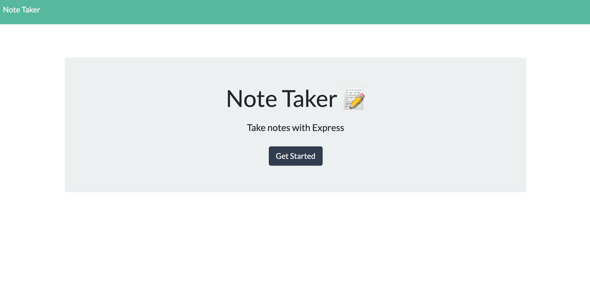
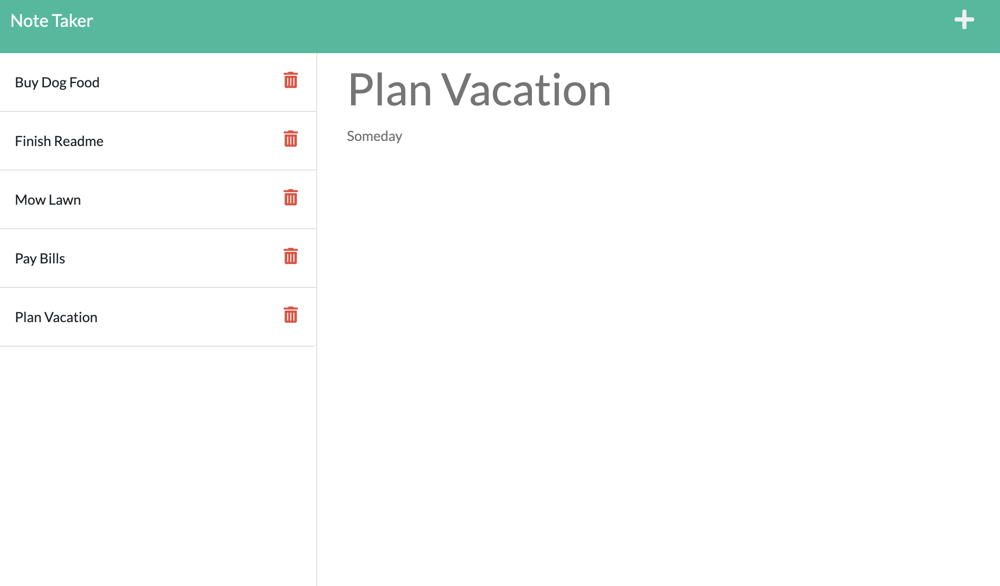

# NOTE TAKER 
[](https://opensource.org/licenses/MIT)

## Index

1. [Description](#description)
2. [Installation](#installation)
3. [Usage](#usage)
4. [Features](#features)
5. [Future Enhancements](#future-enhancements)
6. [Contributing](#contributing)
7. [Resources](#resources)
8. [License](#license)

## Description

```
This app allows the user to track tasks by providng the ability to write, save and delete notes. When the user opens Note Taker, a landing page is presented with a link to the notes page. After clicking on the link to the notes page the user is presented with a list of existing notes in the left hand column along a note taking feature in the right hand column. 

The user can use the note taking feature to enter the note title and text then click the save button to populate the note in the left hand column with other notes. If the user would like to enter another note, the plus symbol clears the note taking feature. If the user would like delete a note they can click on the delete (trash) icon. 
```

## Installation

(1) Fork the repo, (2) Clone the forked repo locally, (3) Run "npm install" (to install the NPM Express dependency), (4) Run "node server.js" to start the server (from the root directory), (5) To open the home page go to http://localhost:3001/. 

If you'd like to use NPM nodemon as/if you make changes to the code, please install nodemon as a development dependency using "npm install --save-dev nodemon" (see https://www.npmjs.com/package//nodemon).

## Usage

This app creates a website which allows a user to track tasks by enter notes for each task.

## Features

This app includes features such as (a) the ability to enter a note title and text, (b) the ability to save each note, (c) the ability to delete each note.
<!-- 
1. TBD
2. TBD
3. TBD
-->
## Future Enhancements

This app can be enhanced by (a) allowing the user to modify notes, (b) adding additional note fields such as date entered (as a default, due date, a status for each note (such as todo, in progress, complete) as an icon or drop down and more, (c) the ability to sort notes based on various criteria such as date due or status or using drag and drop functionality, (d) the ability to archive notes or group notes based on common tasks, and (e) more.
<!-- 
1. TBD
2. TBD
3. TBD
-->

## App Preview - Home Page Screenshot



## App Preview - Note Page Screenshot

<!--  -->


## App Preview - Video Preview
[Link to Video](https://youtu.be/odtZNxBx4_c)


## Tests

No tests are setup at this time.

## Contributing

Contributor Covenant Code of Conduct

[](https://www.contributor-covenant.org/version/2/1/code_of_conduct/code_of_conduct.md)

<!-- DELETE THIS SECTION FOR THE FINAL README. For more information on example contribution guidelines please see the links below.

1. Contributor Convent: [Information](https://www.contributor-covenant.org/)
2. Contributor Covenant Code of Conduct: [Markdown File](hhttps://www.contributor-covenant.org/version/2/1/code_of_conduct/code_of_conduct.md)
-->

## Resources

1. Project Manager: [Steve Calla - GitHub Profile](https://github.com/stevecalla)
2. GitHub Repo: <https://github.com/stevecalla/note-taker>
3. GitHub Hosted URL: <https://calla-note-taker.herokuapp.com/notes>
4. Contact: [Email Steve](mailto:callasteven@gmail.com)

## License 

[](https://opensource.org/licenses/MIT)
This project is licensed under the terms of the <span style="color:red">The MIT License</span>. Please click on the license badge for more information.

<!-- DELETE THIS SECTION FOR THE FINAL README. Per Github, you are under no obligation to choose a license. However, without a license, the default copyright laws apply, meaning that you retain all rights to your source code and no one may reproduce, distribute, or create derivative works from your work. If you're creating an open source project, we strongly encourage you to include an open source license. The Open Source Guide provides additional guidance on choosing the correct license for your project. SEE THE FOLLOWING LINKS FOR MORE INFORMATION:

1. GitHub: [Licensing a repository](https://docs.github.com/en/repositories/managing-your-repositorys-settings-and-features/customizing-your-repository/licensing-a-repository)
2. Open Source Guide: [To Choose A License](https://choosealicense.com/)
-->

<!-- OTHER SECTIONS IF YOU LIKE
## Technologies

1. HTML
2. CSS
3. JavaScript
4. GitHub (website hosting and source code management)
5. TBD
6. TBD

### 3rd Party Application Programming Interfaces

1. [TBD](https://TBD)
2. [TBD](https://TBD)
3. [TBD](https://TBD)

### Dependencies

1. [VS Code Live Server](https://ritwickdey.github.io/vscode-live-server/)

## Collaborators

1. FIRST & LAST NAME: [Github LINK](https://github.com/<Github user name>/)
2. FIRST & LAST NAME: [Github LINK](https://github.com/<Github user name>/)
3. FIRST & LAST NAME: [Github LINK](https://github.com/<Github user name>/)

## Resources

1. GitHub Repo: <https://github.com/tbd/tbd>
2. GitHub Hosted URL: <https://tbd.tbd.com/tbd>
-->
